# Results for the double inverted pendulum

---

**Table 1: Exploration parameter = 8**

|      | $\gamma = 0.96$                                         | $\gamma = 0.97$                                         | $\gamma = 0.98$                                         | $\gamma = 0.99$                                         |
| ---- | ------------------------------------------------------- | ------------------------------------------------------- | ------------------------------------------------------- | ------------------------------------------------------- |
| Mean | 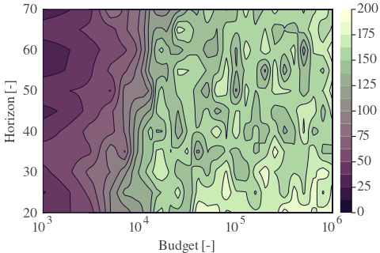 | 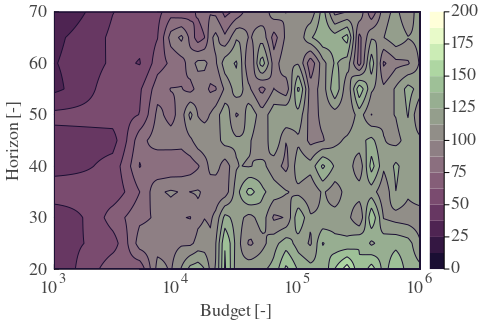 | 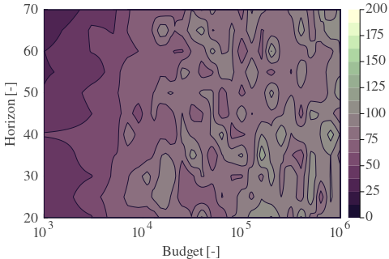 | 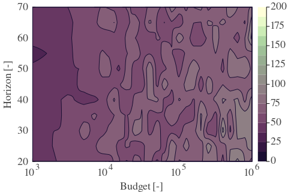 |
| Std  | 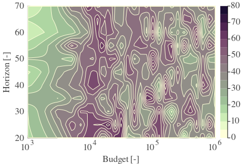  | 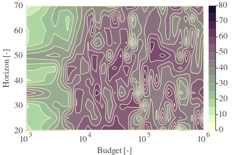  | 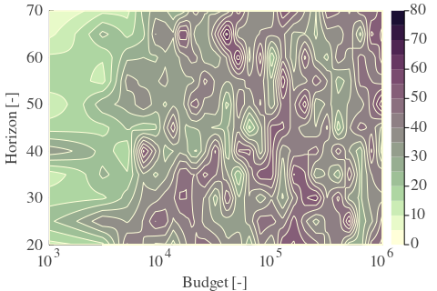  | 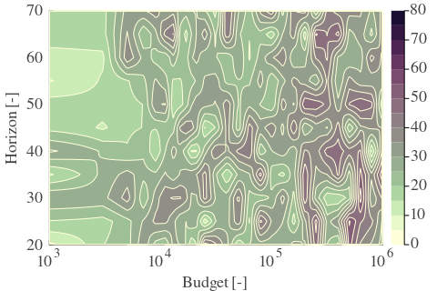  |

---

**Table 2: Exploration parameter = 16**

|      | $\gamma = 0.96$                                         | $\gamma = 0.97$                                         | $\gamma = 0.98$                                         | $\gamma = 0.99$                                         |
| ---- | ------------------------------------------------------- | ------------------------------------------------------- | ------------------------------------------------------- | ------------------------------------------------------- |
| Mean | 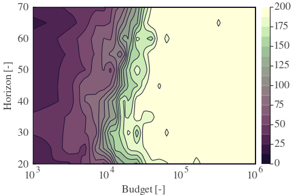 | 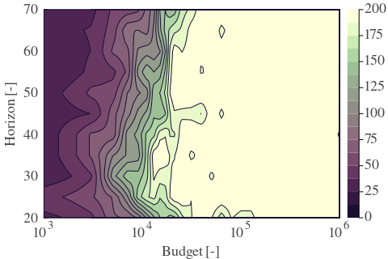 | 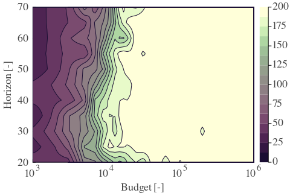 | 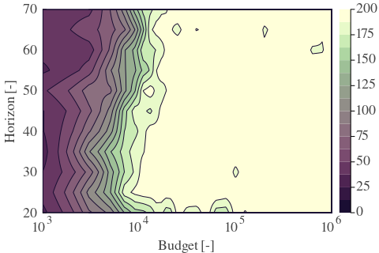 |
| Std  | 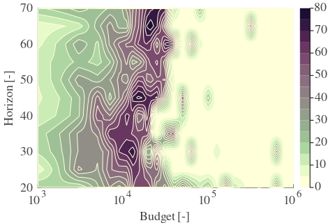  | 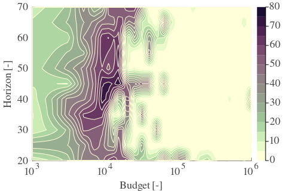  | 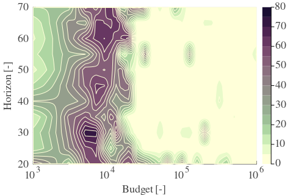  | 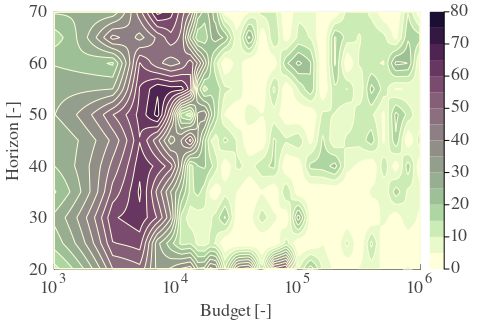  |

---

**Table 3: Exploration parameter = 32**

|      | $\gamma = 0.96$                                         | $\gamma = 0.97$                                         | $\gamma = 0.98$                                         | $\gamma = 0.99$                                         |
| ---- | ------------------------------------------------------- | ------------------------------------------------------- | ------------------------------------------------------- | ------------------------------------------------------- |
| Mean | 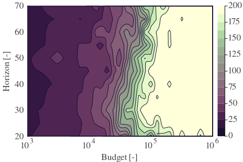 | 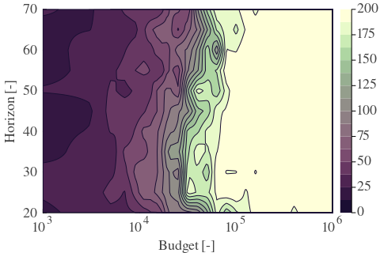 | 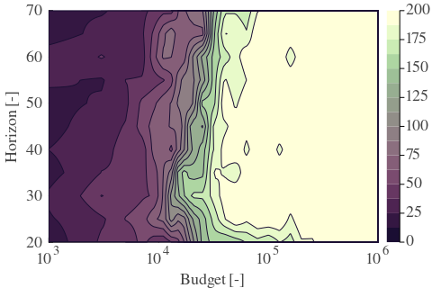 | 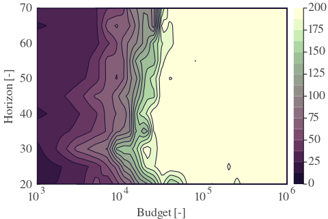 |
| Std  |   | 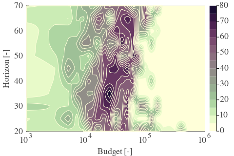  | 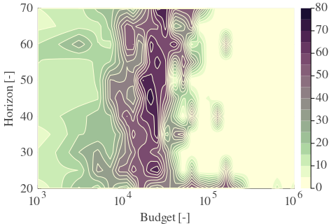  | 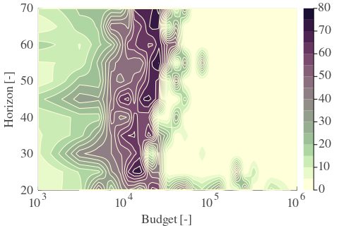  |
