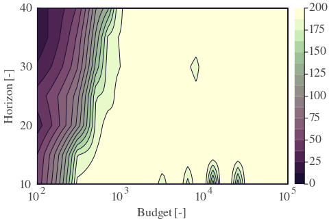
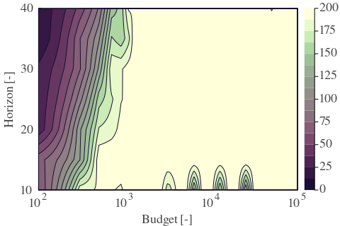
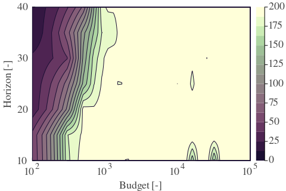
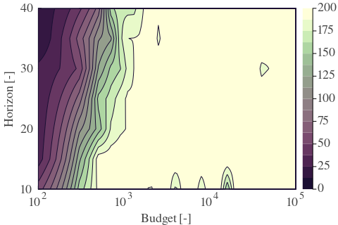
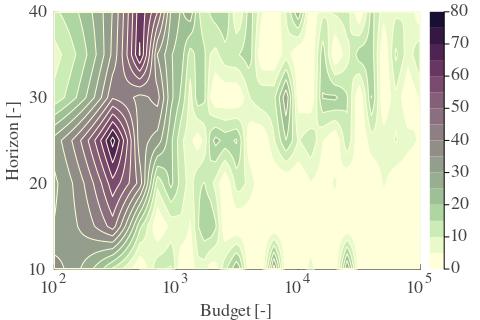
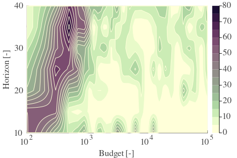
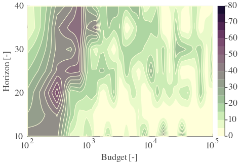
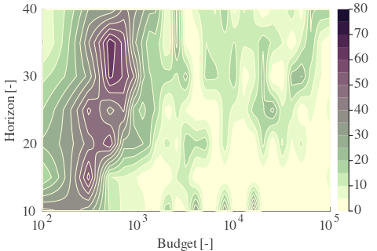

# Results based on the analys of the inverted pendulums on the cart

This is the supplementary material for the paper XYZ - paper details will be updated after publishing. 

---

**Table 1: Exploration parameter = 4**

|      | $\gamma = 0.96$                                         | $\gamma = 0.97$                                         | $\gamma = 0.98$                                         | $\gamma = 0.99$                                         |
| ---- | ------------------------------------------------------- | ------------------------------------------------------- | ------------------------------------------------------- | ------------------------------------------------------- |
| Mean |  |  |  |  |
| Std  |   |   |   |   |