# Results for the single pendulum

---

**Table 1: Exploration parameter = 4**

|      | $\gamma = 0.96$                                         | $\gamma = 0.97$                                         | $\gamma = 0.98$                                         | $\gamma = 0.99$                                         |
| ---- | ------------------------------------------------------- | ------------------------------------------------------- | ------------------------------------------------------- | ------------------------------------------------------- |
| Mean |  |  |  |  |
| Std  |   |   |   |   |

---

**Table 2: Exploration parameter = 8**

|      | $\gamma = 0.96$                                         | $\gamma = 0.97$                                         | $\gamma = 0.98$                                         | $\gamma = 0.99$                                         |
| ---- | ------------------------------------------------------- | ------------------------------------------------------- | ------------------------------------------------------- | ------------------------------------------------------- |
| Mean | 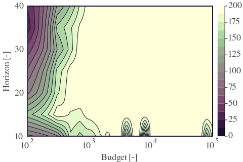 | 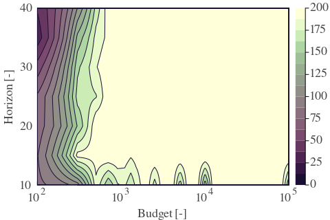 | 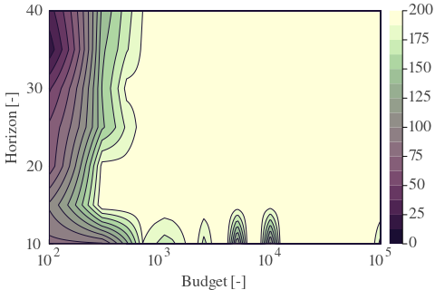 | 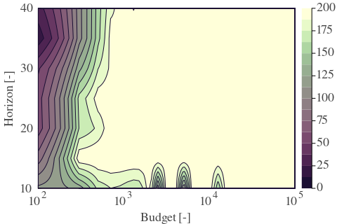 |
| Std  | 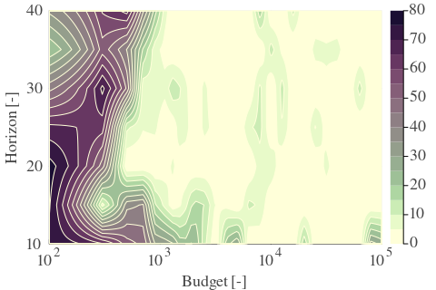  | 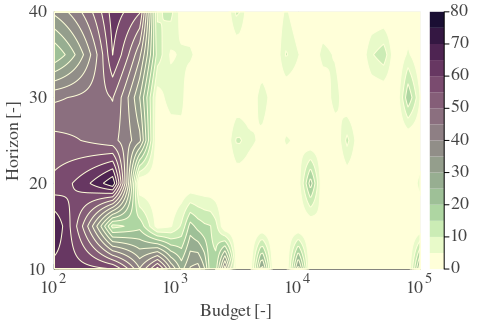  | 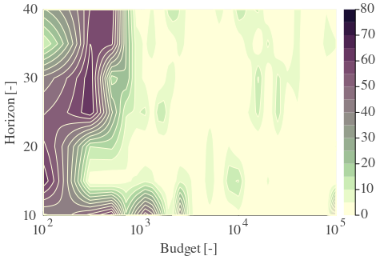  | 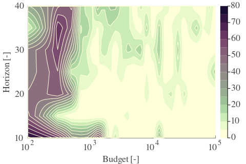  |

---

**Table 3: Exploration parameter = 16**

|      | $\gamma = 0.96$                                         | $\gamma = 0.97$                                         | $\gamma = 0.98$                                         | $\gamma = 0.99$                                         |
| ---- | ------------------------------------------------------- | ------------------------------------------------------- | ------------------------------------------------------- | ------------------------------------------------------- |
| Mean | 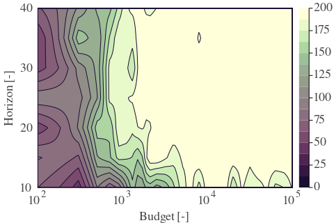 | 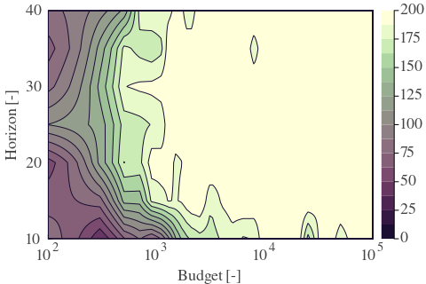 | 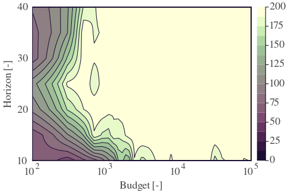 | 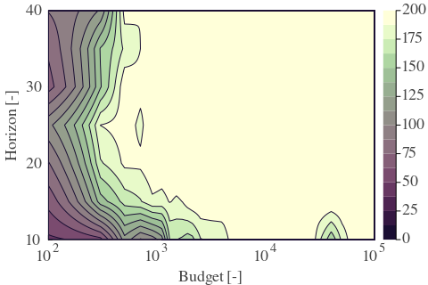 |
| Std  | 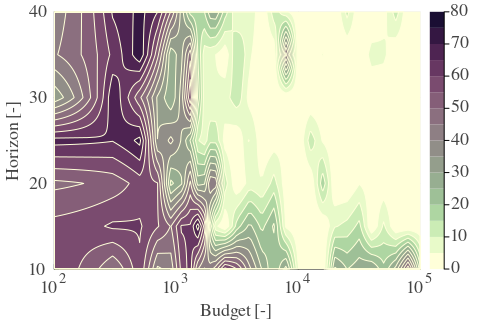  | 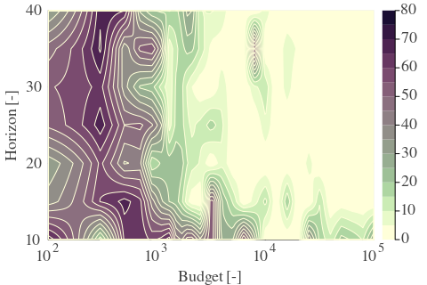  | 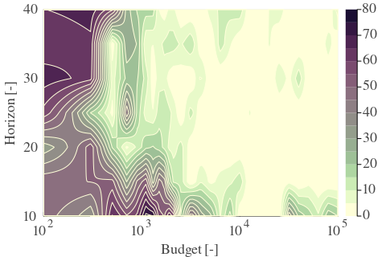  | 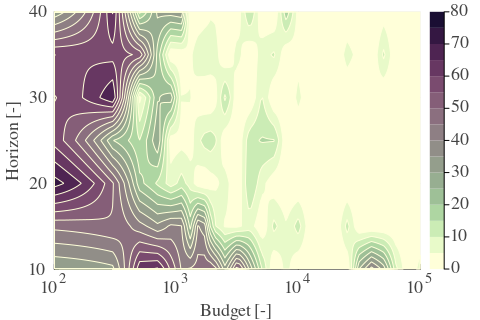  |

---

**Table 4: Exploration parameter = 32**

|      | $\gamma = 0.96$                                         | $\gamma = 0.97$                                         | $\gamma = 0.98$                                         | $\gamma = 0.99$                                         |
| ---- | ------------------------------------------------------- | ------------------------------------------------------- | ------------------------------------------------------- | ------------------------------------------------------- |
| Mean | 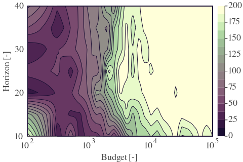 | 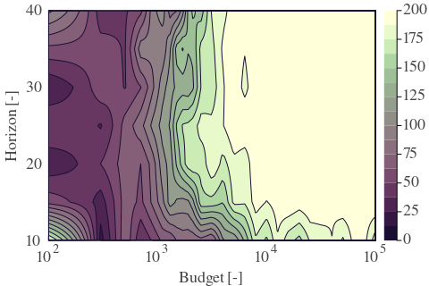 | 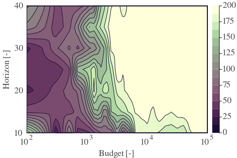 | 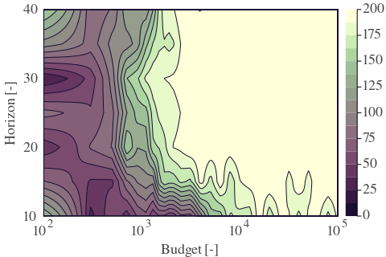 |
| Std  | 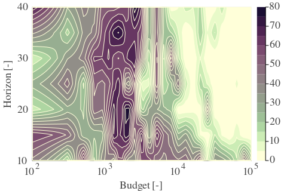  | 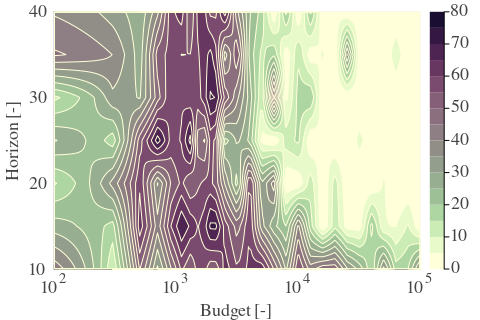  | 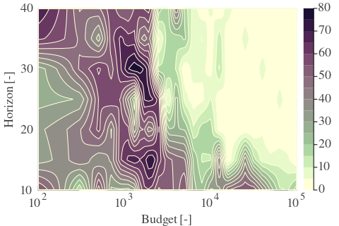  | 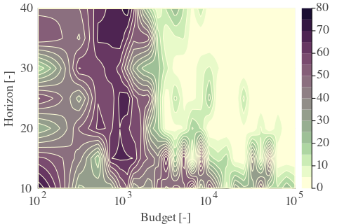  |

---

**Table 5: Exploration parameter = 64**

|      | $\gamma = 0.96$                                         | $\gamma = 0.97$                                         | $\gamma = 0.98$                                         | $\gamma = 0.99$                                         |
| ---- | ------------------------------------------------------- | ------------------------------------------------------- | ------------------------------------------------------- | ------------------------------------------------------- |
| Mean | 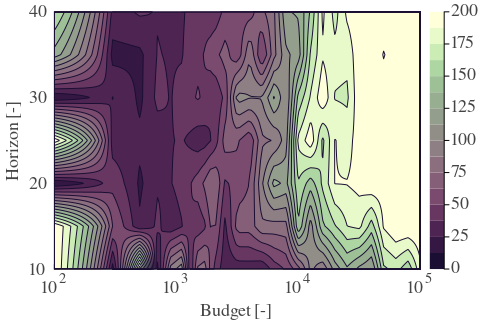 | 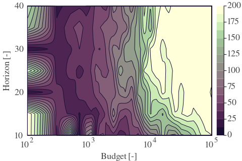 | 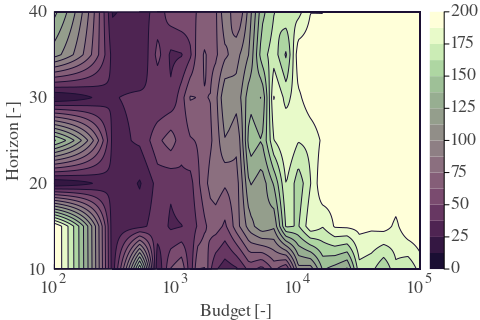 | 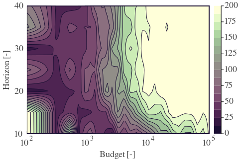 |
| Std  | 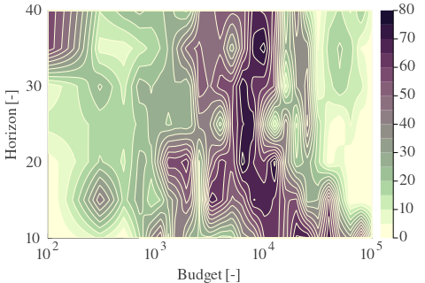  | 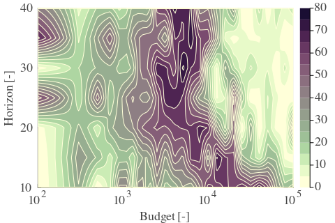  | 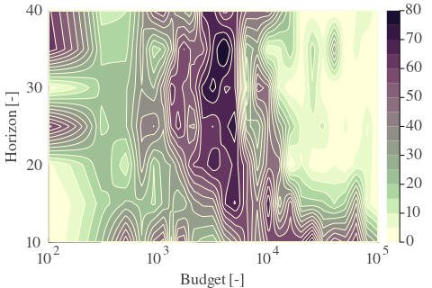  | 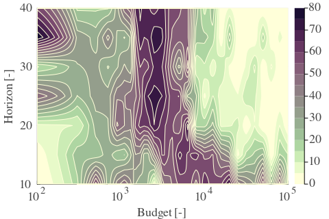  |

---

**Table 6: Exploration parameter = 128**

|      | $\gamma = 0.96$                                         | $\gamma = 0.97$                                         | $\gamma = 0.98$                                         | $\gamma = 0.99$                                         |
| ---- | ------------------------------------------------------- | ------------------------------------------------------- | ------------------------------------------------------- | ------------------------------------------------------- |
| Mean | 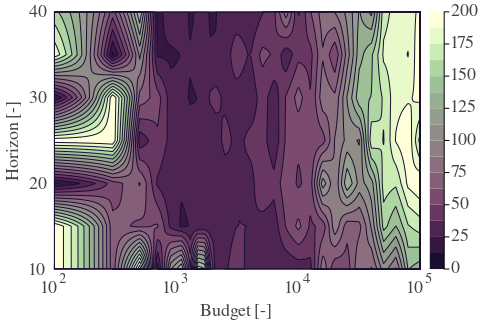 | 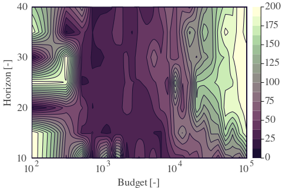 | 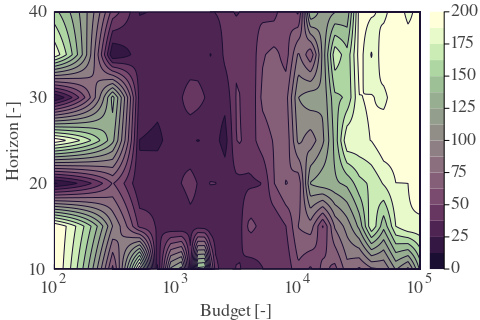 | 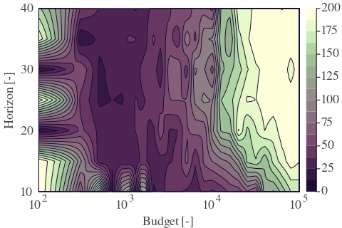 |
| Std  | 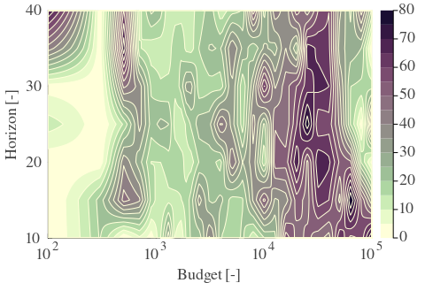  | 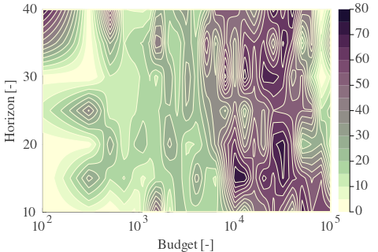  | 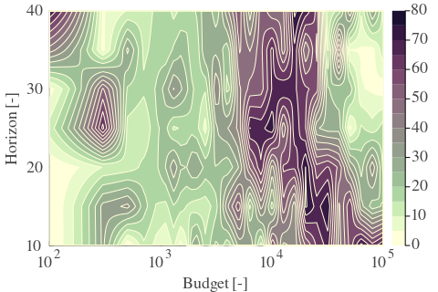  | 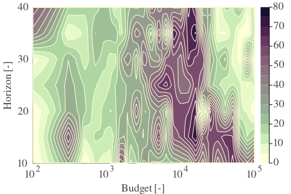  |

---

**Table 7: Exploration parameter = 256**

|      | $\gamma = 0.96$                                         | $\gamma = 0.97$                                         | $\gamma = 0.98$                                         | $\gamma = 0.99$                                         |
| ---- | ------------------------------------------------------- | ------------------------------------------------------- | ------------------------------------------------------- | ------------------------------------------------------- |
| Mean | 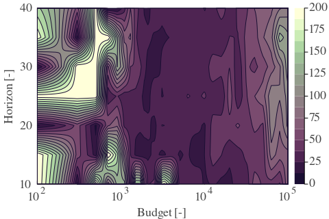 | 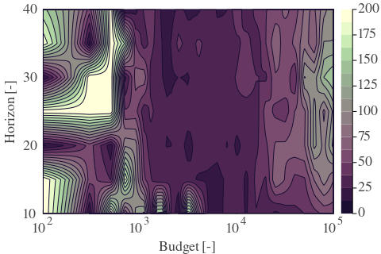 | 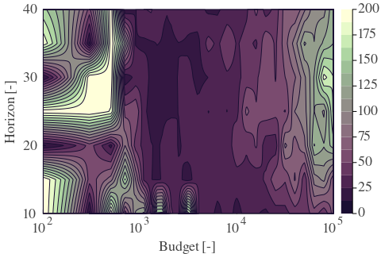 | 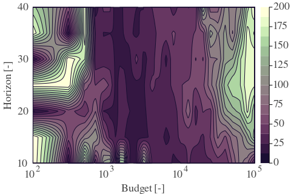 |
| Std  | 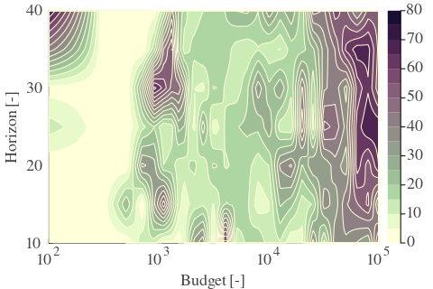  | 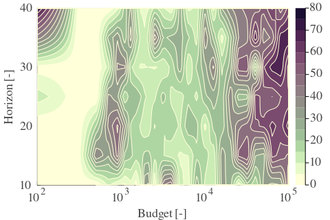  | 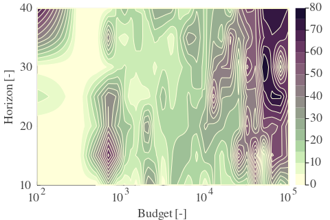  | 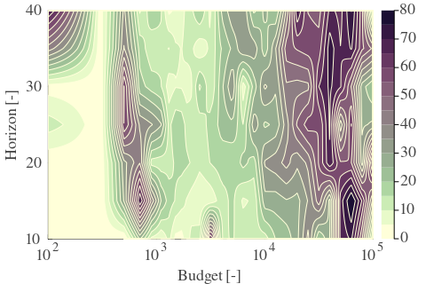  |

---

**Table 8: Exploration parameter = 512**

|      | $\gamma = 0.96$                                         | $\gamma = 0.97$                                         | $\gamma = 0.98$                                         | $\gamma = 0.99$                                         |
| ---- | ------------------------------------------------------- | ------------------------------------------------------- | ------------------------------------------------------- | ------------------------------------------------------- |
| Mean | 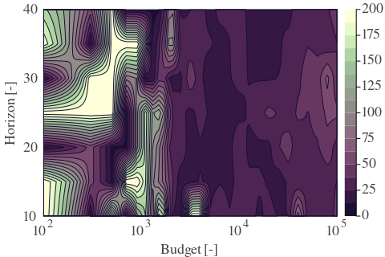 | 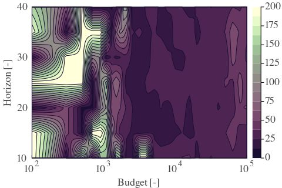 |  |  |
| Std  |   |   |   |   |